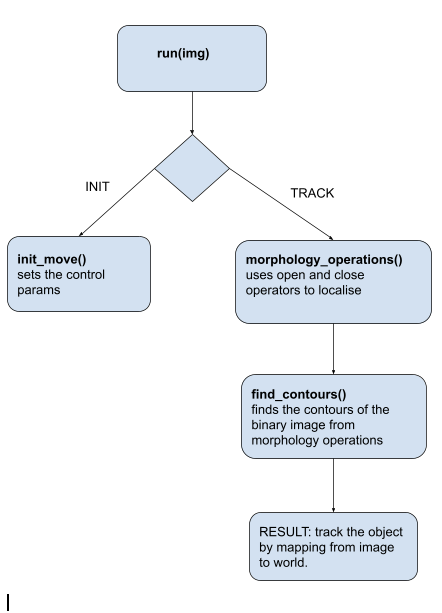
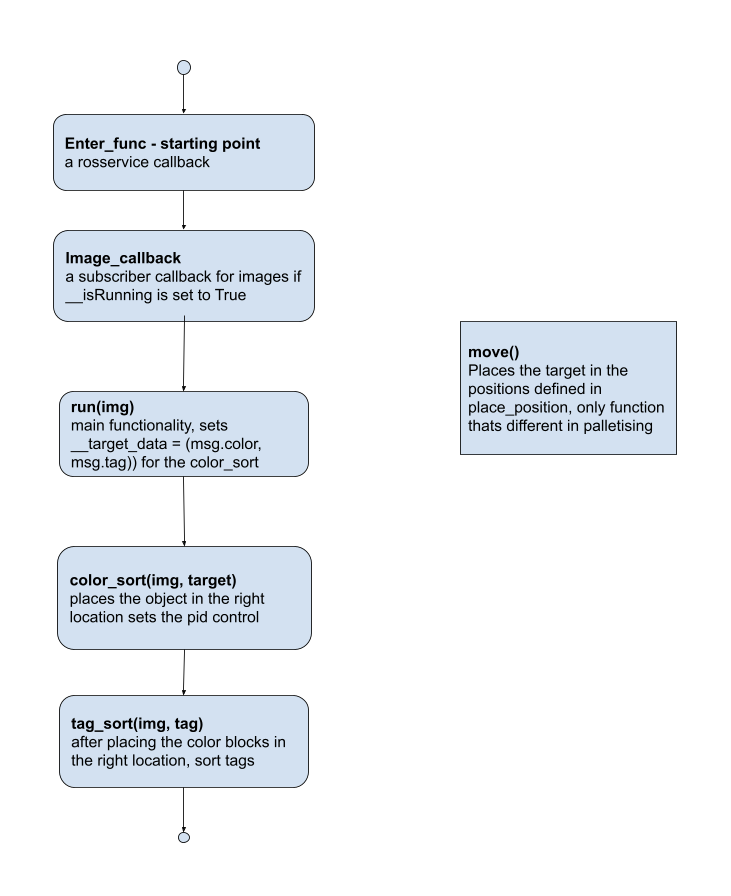

# RobotSystems
Assignment for Perception on HiWonderArm: 

⋅⋅*Since getAreaMaxContour has no change across all 3 files I haven't  changed  anything on it.
⋅⋅*Skipped move and init() functions, since they are control functions.
⋅⋅*Tested run_track() for tracking the red-cube with the arm.
*Perception Flow Chart for tracking and palletising*

